# [FactoryIO] 실습0 (준비 및 설정)

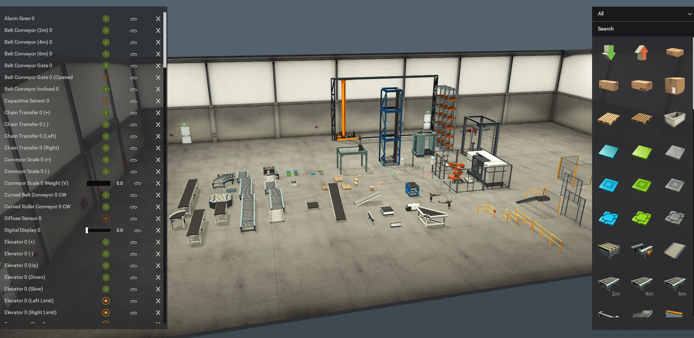


#FactoryIO #실습 #설정 #시뮬레이션


# [FactoryIO] 실습1 (옵션설정)


<video src="/attachments/card-1783301498161/f1.mp4" controls playsinline autoplay muted loop width="100%"></video>

- Emmiter 옵션 (생성관여)
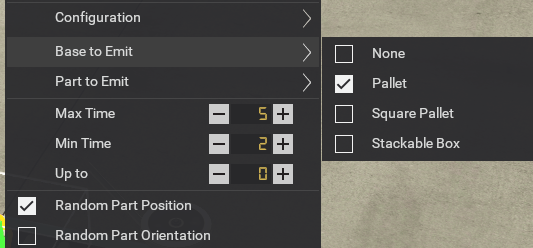


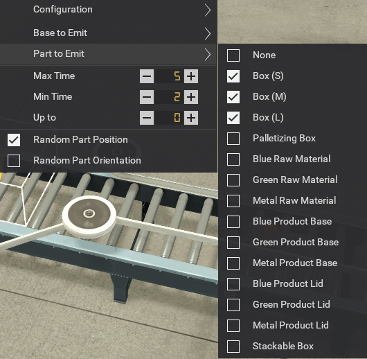


- 박스의 위치도 랜덤하게
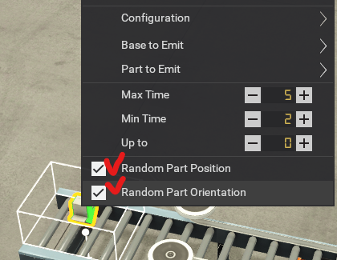

#FactoryIO #실습 #옵션설정 #Emmiter #랜덤

# [FactoryIO] 실습2 (센서설정, 종류)

<video src="/attachments/card-1783305350690/f2.mp4" controls playsinline autoplay muted loop width="100%">
</video>

- Retroreflective sensor

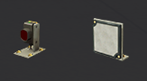

>Retroreflective sensor(레트로리플렉티브 센서)
발광부와 수광부가 한 몸체에 들어 있고, 맞은편에 설치된 반사판(레트로리플렉터)을 이용해 빛을 되돌려 받는 방식으로 물체를 감지하는 광센서.
 물체가 센서와 반사판 사이를 지나 빛을 차단하면 출력 신호가 발생. 설치가 간단하고 감지 거리가 길어 산업 자동화에 널리 쓰임.


🔎 동작 원리

발광부(Emitter): LED 또는 레이저 다이오드가 특정 주파수로 변조된 빛(적외선, 가시광선)을 방출.

반사판(Retroreflector): 코너 큐브 프리즘이나 반사 테이프가 빛을 원래 방향으로 정확히 되돌려 줌.

수광부(Receiver): 되돌아온 빛을 감지. 물체가 빛을 차단하면 수광 신호가 급격히 줄어들어 센서 출력이 전환됨.

- 반사판이 없을 때
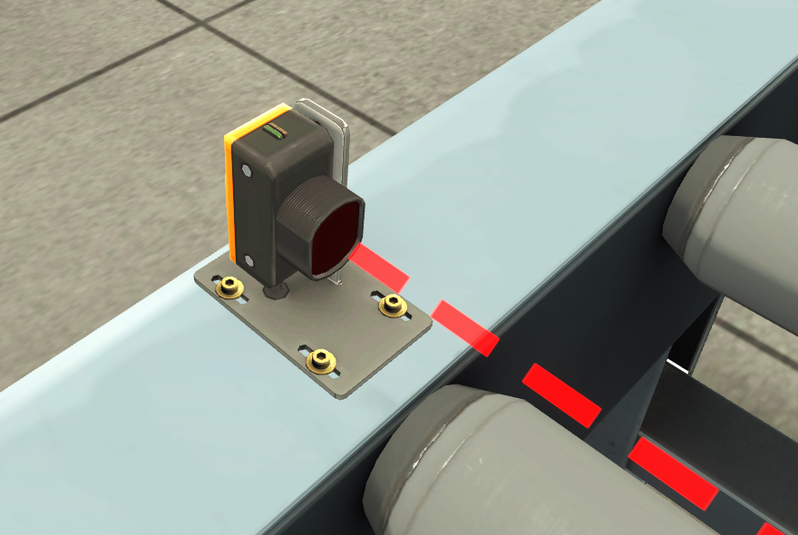

- 반사판 연결 초록불
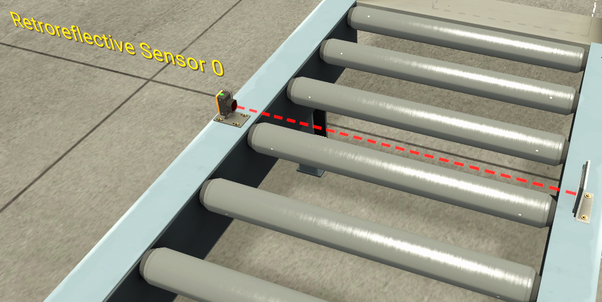
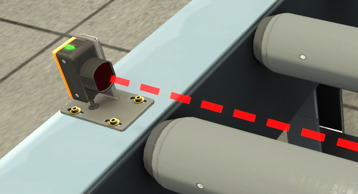

#FactoryIO #레트로리플렉티브센서 #광센서 #산업자동화 #센서설정

# [FactoryIO] 실습3 (버튼설정, 종류)

<video src="/attachments/card-1783307854396/f3.mp4" controls playsinline autoplay muted loop width="100%"></video>

### 버튼류
- Normal Open - NO
평소에 0... 누르면 1  

- Normal Close - NC
평소에 1... 누르면 0  

- 주로 Emergency Button 류는 NC이다.

#FactoryIO #버튼 #NC #NO

# [FactoryIO] 실습4 (모드버스설정, 연동)


(디지털)읽기전용
10001 , 10002 ....
Descrete inputs : 입력(상태를 본다?, 상태를 읽어온다)

(디지털)읽기, 쓰기용
00001, 00002, 00003....
coils  : 출력

(아날로그)읽기전용
30001, 30002 ....
Input Registers

(아날로그)읽기, 쓰기용
40001, 40002 ....
Holding Registers
---
[[FA] docker-compose 로 모드버스 실습 컨테이너 실습1](./README.md)
[[FA] docker-compose 로 모드버스 실습 컨테이너 실습2](./README.md)
[[FA] docker-compose 로 모드버스 실습 컨테이너 실습3](./README.md)

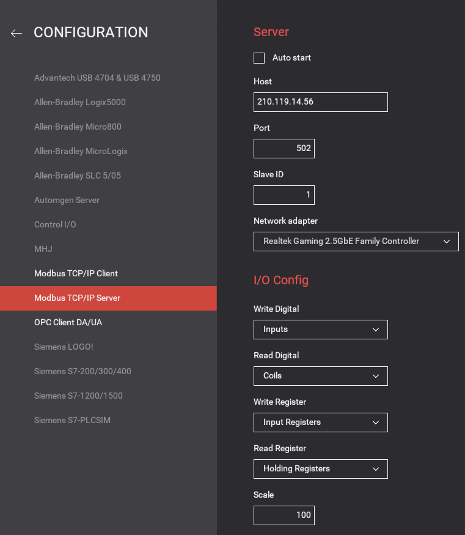
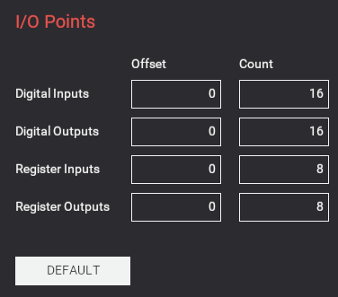

- 주의점
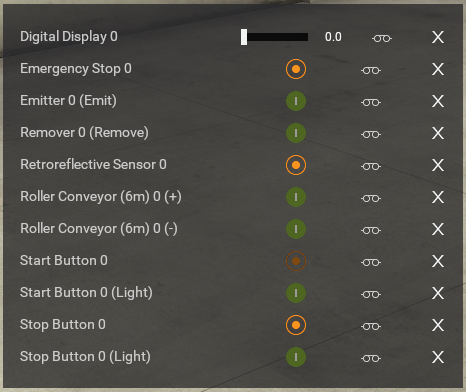

연결모드가 Nofailure 


이 모양이 되어있어야 한다.

#FactoryIO #모드버스 #연동 #디지털 #아날로그

# [FactoryIO] 실습7 (Py으로 단계별 제어)

1)스캔방식으로 첫번째 센서 값 읽어오기
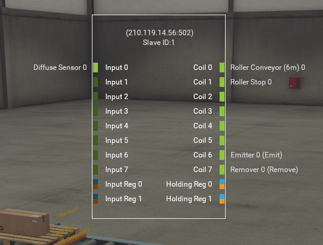

>Diffuse 센서는 빛을 물체에 쏘아 반사된 빛을 감지해 물체의 존재를 판별하는 광센서 (NO 방식)
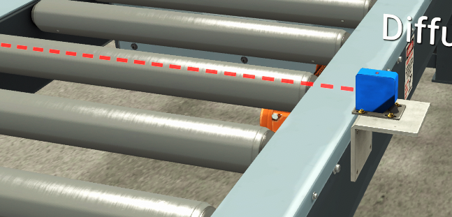

```py
import pymodbus
import time as tt
from pymodbus.client import ModbusTcpClient
client = ModbusTcpClient('210.119.14.56', port=502)
for n in range(10000):
    result = client.read_discrete_inputs(0, count=8, device_id=1) # 옛 slave, unit_id
    print(f"\r{result.bits}",end="")
    tt.sleep(0.1)
print("스캔종료")
```

2) 스토퍼 추가하기
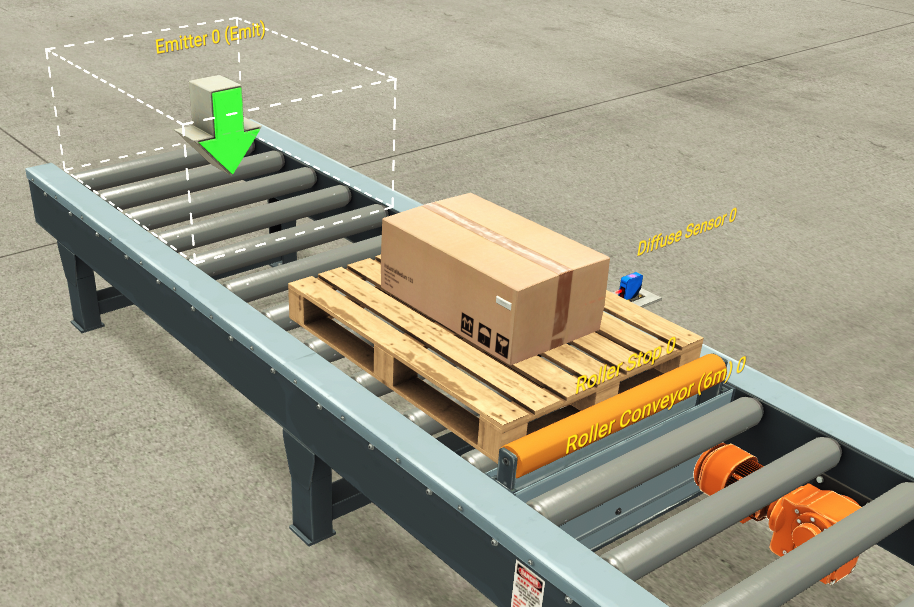

```py
import time as tt
# 컨베어, 이미터, 리무버  켜기
client.write_coil(0, 1)
client.write_coil(6, 1)
client.write_coil(7, 1)
for n in range(10000):
    sensor = client.read_discrete_inputs(0, count=8, device_id=1).bits[0] # 옛 slave, unit_id
    print(f"\r{sensor}",end="")

    if sensor:
        client.write_coil(1, 1) # 스토퍼 ON
        tt.sleep(3)
        client.write_coil(1, 0)
        tt.sleep(3)
    else:
        client.write_coil(1, 0) # 스토퍼 OFF
    
    tt.sleep(0.1)
print("스캔종료") 
```

3) 푸셔 추가하기

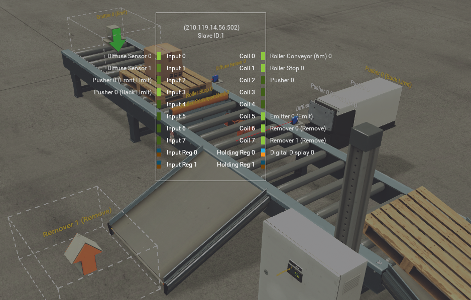

#FactoryIO #ModbusTCP #Python #단계별제어

# [Factory IO] 파일저장/복구 위치

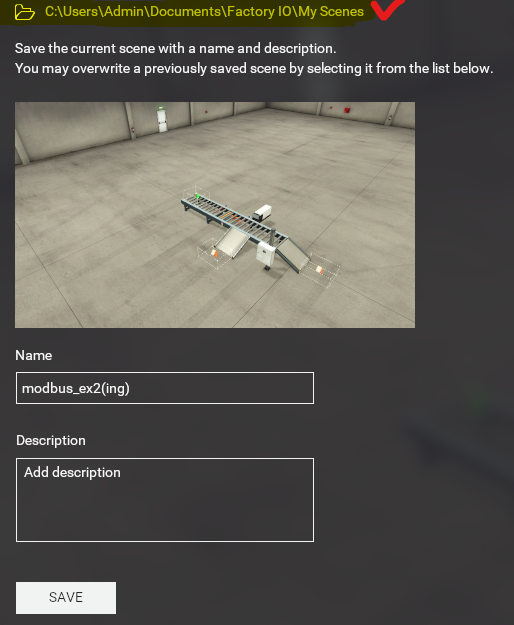

>C:\Users\ `자기계정` \Documents\Factory IO\My Scenes

# [PY] pymdbus 메소드
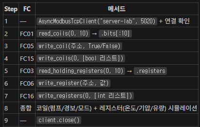

#pymdbus #python #dbus #메소드

# [FactoryIO] 디지털트윈 / 스마트팩토리 원격제어

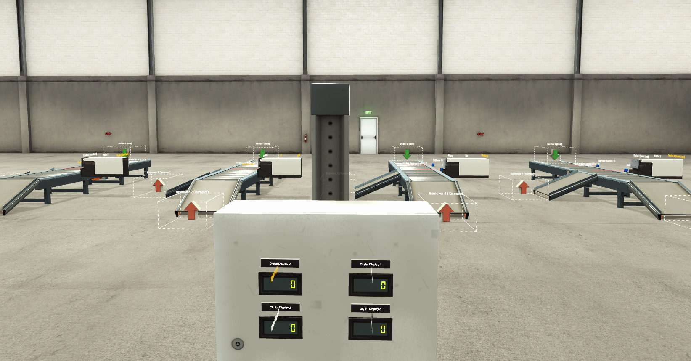

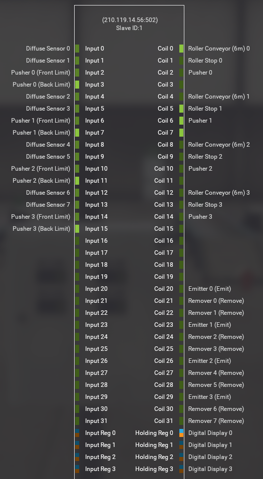

# [FactoryIO] 실습8 (물류,이송,분류)

<video src="/attachments/card-1783487187856/f7.mp4" controls playsinline autoplay muted loop width="100%"></video>

``

센서 :
- 위치가 안맞을 경우
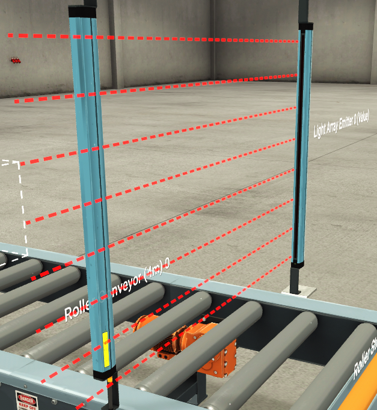
- 리시버에 맞을 경우 (초록LED)
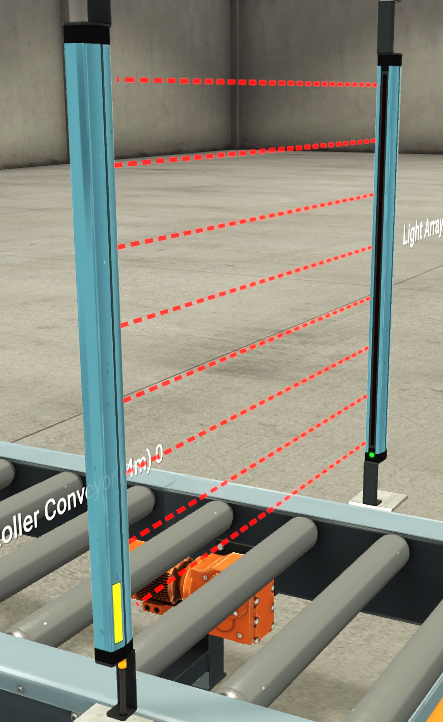


```py
# 모드버스접속
from pymodbus.client import ModbusTcpClient
import time as tt
import threading
client = ModbusTcpClient('210.119.14.56', port=502)
client.connect()
# 초기화
client.write_coils(0, [0]*16 )
# 켜야되는 출력 8부터 8개 모두 On
client.write_coils(8, [1]*8 )
# 센서의 값 가지고 오기
sensor_scan = True
step = [0,0]

def sscan():
    while sensor_scan:
        ir = client.read_input_registers(0, count=8 ).registers[0]
        front_limit = client.read_discrete_inputs(0,count=8).bits[3]
        if ir == 224:
            client.write_coil(3,1)
            step[0] = 0
        if step[0] == 0 and (ir == 192 or ir == 128):
            client.write_coil(3,1) # 턴테이블 +이동
            step[0] = 1   
        if step[0] == 1 and front_limit:                                      
            client.write_coil(3,0) # 턴테이블 +정지
            client.write_coil(0,1) # 스토퍼 on
            client.write_coil(2,1) # 턴테이블 터닝 on
            step[1] = 1
        if step[1] == 1 and client.read_discrete_inputs(0,count=8).bits[1]: # 턴테이블이 돌았는지
            client.write_coil(2,1)
            client.write_coil(3,1)
            tt.sleep(3)
            client.write_coil(2,0)
            client.write_coil(0,0)
            step[0] = 0
            step[1] = 0

        tt.sleep(0.1)

thread_scan = threading.Thread(target=sscan, daemon=True)
print("센서로드 쓰레드 시작")
thread_scan.start()
```

#FactoryIO #물류 #자동화 #센서 #모드버스

# [FactoryIO] 실습9 (불량 분류)

- 이미터 세팅
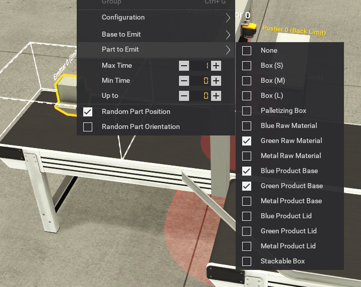

- 비전카메라 세팅
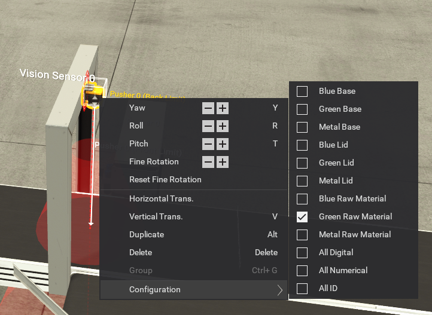

- Modbus IO 세팅
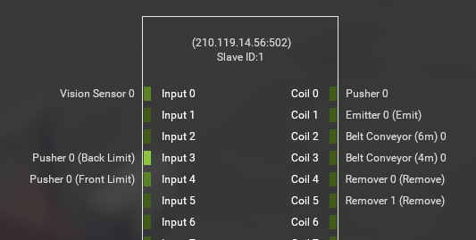

```py
# 방법 1 sleep 을 사용 안하기
# 센서의 값 가지고 오기
scan_run = True
mem = [0]
def vscan():
    while scan_run:
       bits = client.read_discrete_inputs(0, count=8).bits
       if bits[0]:
        if mem[0] == 0:
            mem[0] = tt.monotonic()
        elif tt.monotonic() - mem[0] >= 1:
            client.write_coil(0,1) # Pusher On
            mem[0] = 0
       if bits[4]: 
        client.write_coil(0,0) # Pusher Off
        mem[0] = 0
        tt.sleep(0.1)
thread_vscan = threading.Thread(target=vscan, daemon=True)
print("센서로드 쓰레드 시작")
thread_vscan.start()
```

#FactoryIO #불량분류 #비전카메라 #Modbus #Python

# [FactoryIO] 실습10 작업중
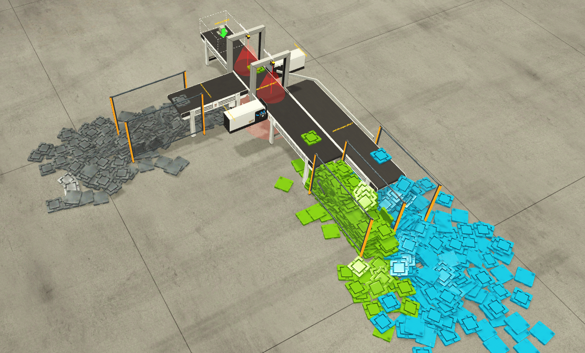
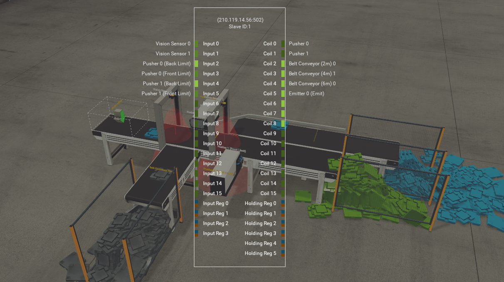

> **📓 ipynb 분석 요약** (pyfa03_a(완).ipynb)

- **주제/목적**: FactoryIO 환경에서 Modbus TCP 통신을 통해 여러 공정(Vscan 클래스)을 제어하고 모니터링하는 예제입니다.

- **주요 흐름**:
    - Modbus TCP 클라이언트를 초기화하고 FactoryIO 서버에 연결합니다.
    - 모든 출력 코일을 초기화하여 Off 상태로 만듭니다.
    - 특정 출력 코일(2번부터 7개)을 On 상태로 설정합니다.
    - `Vscan` 클래스를 정의하여 각 공정의 센서 입력(`bit1`, `bit2`)을 읽고, 특정 조건(1초 동안 `bit1`이 On 상태 유지)에 따라 출력 코일(`coil`)을 제어합니다.
    - 두 개의 `Vscan` 객체(`vscan1`, `vscan2`)를 생성하고 각각의 센서와 제어 코일을 설정하여 스레드로 실행합니다.

- **사용 기술**:
    - `pymodbus`: Modbus TCP 통신 라이브러리
    - `threading`: 비동기 공정 처리를 위한 스레드 사용
    - `time`: 시간 관련 함수 (타이머 기능)

- **결과/결론**:
    - Modbus 서버와의 연결이 성공적으로 이루어집니다.
    - 출력 코일 제어가 가능하며, `Vscan` 클래스를 통해 정의된 두 개의 공정이 독립적인 스레드로 실행되어 FactoryIO 환경의 센서 상태에 따라 제어 코일을 on/off 합니다.

---

클래스로 처리
```py
# 클래스로 2공정 묶기

class Vscan:
    def __init__(self, client, bit1, bit2, coil):
        self.client = client
        self.scan_run = True
        self.bit1 = bit1
        self.bit2 = bit2
        self.coil = coil
        self.mem = 0

    def run(self):
        while self.scan_run:
            bits = self.client.read_discrete_inputs(0, count=8).bits
            if bits[self.bit1]:
                if self.mem == 0:
                    self.mem = tt.monotonic()
                elif tt.monotonic() - self.mem >= 1:
                    self.client.write_coil(self.coil,1) # Pusher On
                    self.mem = 0
            else:
                self.mem = 0  
            if bits[self.bit2]: 
                self.client.write_coil(self.coil,0) # Pusher Off
                self.mem = 0
            tt.sleep(0.1)

    def start(self):
        self.thread = threading.Thread(target=self.run, daemon=True)
        self.thread.start()
        print("쓰레드 시작")
    def stop(self):
        self.scan_run = False
vscan1 = Vscan(client, 0, 3, 0)
vscan2 = Vscan(client, 1, 5, 1)
vscan1.start()
vscan2.start()
```

#FactoryIO #ModbusTCP #pymodbus #Vscan #threading
