# [Nodered] Docker network & Ping test 실습

### 도커네트워크로 컨테이너 네트워크 연결

`docker network ls`

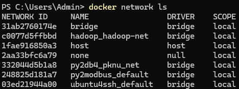

- 다음 명령어로 연결
`docker network connect py2modbus_default mynodered`

### ping 테스트
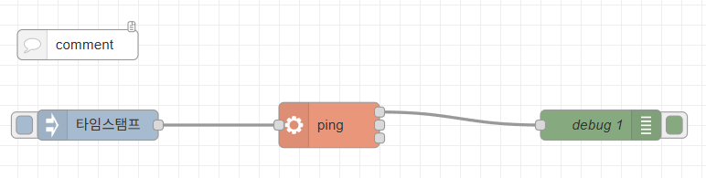

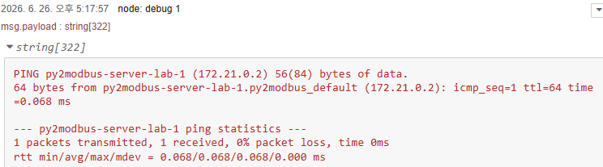


```json
[
    {
        "id": "631fa766c7655835",
        "type": "inject",
        "z": "9465a9613d755f62",
        "name": "",
        "props": [
            {
                "p": "payload"
            }
        ],
        "repeat": "",
        "crontab": "",
        "once": false,
        "onceDelay": 0.1,
        "topic": "",
        "payload": "",
        "payloadType": "date",
        "x": 140,
        "y": 180,
        "wires": [
            [
                "e596fb128cb81dc0"
            ]
        ]
    },
    {
        "id": "0ca6733297e7e675",
        "type": "debug",
        "z": "9465a9613d755f62",
        "name": "debug 1",
        "active": true,
        "tosidebar": true,
        "console": false,
        "tostatus": false,
        "complete": "payload",
        "targetType": "msg",
        "statusVal": "",
        "statusType": "auto",
        "x": 640,
        "y": 180,
        "wires": []
    },
    {
        "id": "e596fb128cb81dc0",
        "type": "exec",
        "z": "9465a9613d755f62",
        "command": "ping",
        "addpay": "",
        "append": "-c 1 py2modbus-server-lab-1",
        "useSpawn": "false",
        "timer": "",
        "winHide": false,
        "oldrc": false,
        "name": "",
        "x": 370,
        "y": 180,
        "wires": [
            [
                "0ca6733297e7e675"
            ],
            [],
            []
        ]
    }
]
```

#nodered #docker #네트워크 #ping #컨테이너 #docker-network

# [Nodered] 노드레드 팔레트로 기능 설치


- 팔레트 관리
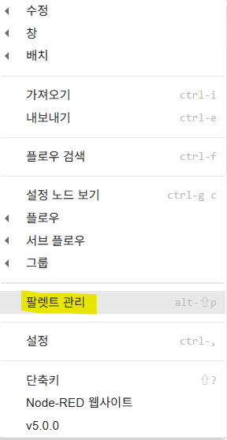
- 검색 후 설치
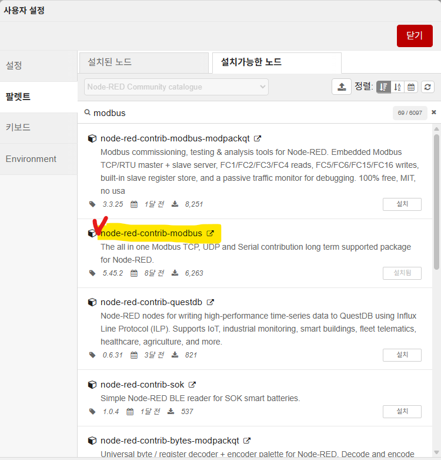
- 알림 팝업


#Node-RED #팔레트 #기능설치

# [Nodered] 모드버스 연결 비트 실습


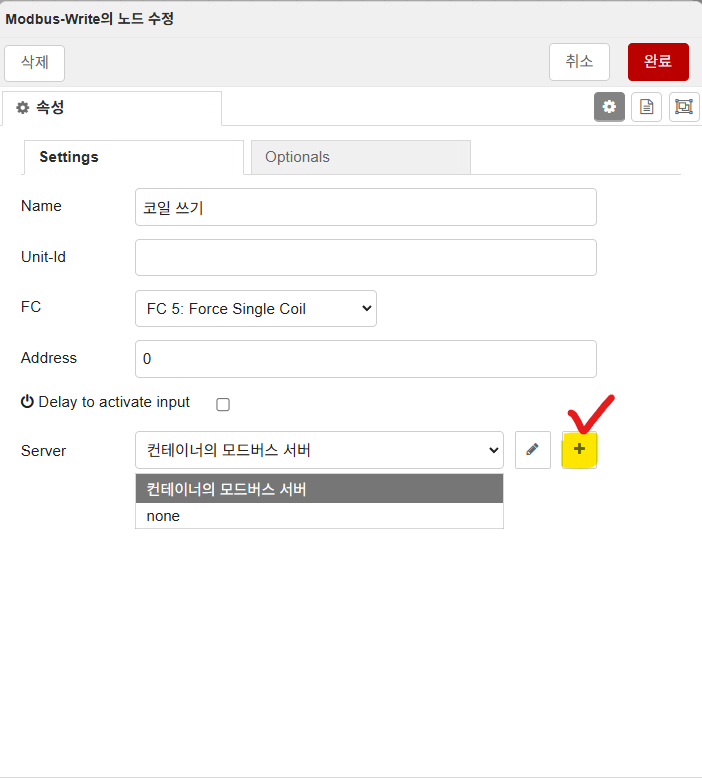
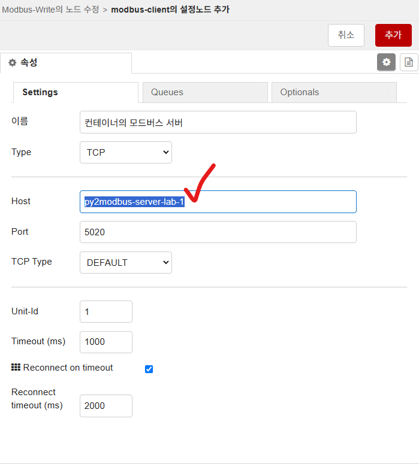

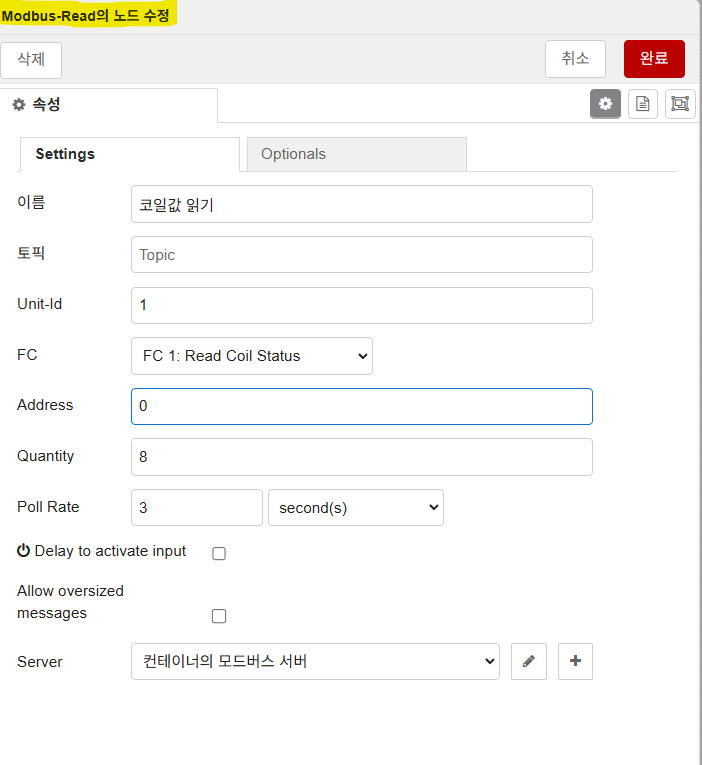
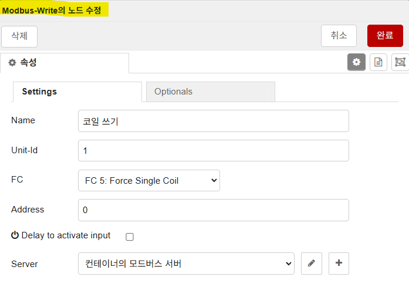

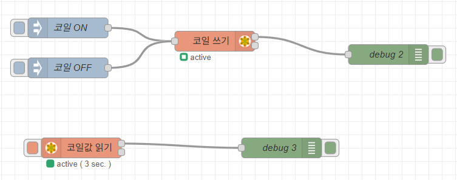

- 컨테이너 속 노드레드에서 모드버스 확인
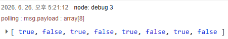

- 컨테이너내에 py으로 만든 모드버스 서버에서
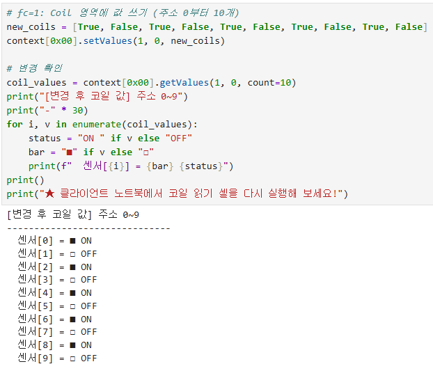

>소스코드
```json
[
    {
        "id": "a82a317b9752d401",
        "type": "inject",
        "z": "ac22995b55c07dac",
        "name": "코일 ON",
        "props": [
            {
                "p": "payload"
            }
        ],
        "repeat": "",
        "crontab": "",
        "once": false,
        "onceDelay": 0.1,
        "topic": "",
        "payload": "true",
        "payloadType": "json",
        "x": 180,
        "y": 100,
        "wires": [
            [
                "180a267c3e1c4e9d"
            ]
        ]
    },
    {
        "id": "25722a8e4ca76c44",
        "type": "inject",
        "z": "ac22995b55c07dac",
        "name": "코일 OFF",
        "props": [
            {
                "p": "payload"
            }
        ],
        "repeat": "",
        "crontab": "",
        "once": false,
        "onceDelay": 0.1,
        "topic": "",
        "payload": "false",
        "payloadType": "json",
        "x": 180,
        "y": 160,
        "wires": [
            [
                "180a267c3e1c4e9d"
            ]
        ]
    },
    {
        "id": "e7b552de1259bace",
        "type": "debug",
        "z": "ac22995b55c07dac",
        "name": "debug 2",
        "active": true,
        "tosidebar": true,
        "console": false,
        "tostatus": false,
        "complete": "false",
        "statusVal": "",
        "statusType": "auto",
        "x": 660,
        "y": 140,
        "wires": []
    },
    {
        "id": "180a267c3e1c4e9d",
        "type": "modbus-write",
        "z": "ac22995b55c07dac",
        "name": "코일 쓰기",
        "showStatusActivities": false,
        "showErrors": false,
        "showWarnings": true,
        "unitid": "1",
        "dataType": "Coil",
        "adr": "0",
        "quantity": "1",
        "server": "ebf780b75f6e4b73",
        "emptyMsgOnFail": false,
        "keepMsgProperties": false,
        "delayOnStart": false,
        "startDelayTime": "",
        "x": 400,
        "y": 120,
        "wires": [
            [
                "e7b552de1259bace"
            ],
            []
        ]
    },
    {
        "id": "dfc3fadc87b9823a",
        "type": "modbus-read",
        "z": "ac22995b55c07dac",
        "name": "코일값 읽기",
        "topic": "",
        "showStatusActivities": false,
        "logIOActivities": false,
        "showErrors": false,
        "showWarnings": true,
        "unitid": "1",
        "dataType": "Coil",
        "adr": "0",
        "quantity": "8",
        "rate": "3",
        "rateUnit": "s",
        "delayOnStart": false,
        "enableDeformedMessages": false,
        "startDelayTime": "",
        "server": "ebf780b75f6e4b73",
        "useIOFile": false,
        "ioFile": "",
        "useIOForPayload": false,
        "emptyMsgOnFail": false,
        "x": 200,
        "y": 280,
        "wires": [
            [
                "6eb795d52d4890c2"
            ],
            []
        ]
    },
    {
        "id": "6eb795d52d4890c2",
        "type": "debug",
        "z": "ac22995b55c07dac",
        "name": "debug 3",
        "active": true,
        "tosidebar": true,
        "console": false,
        "tostatus": false,
        "complete": "false",
        "statusVal": "",
        "statusType": "auto",
        "x": 500,
        "y": 280,
        "wires": []
    },
    {
        "id": "ebf780b75f6e4b73",
        "type": "modbus-client",
        "name": "컨테이너의 모드버스 서버",
        "clienttype": "tcp",
        "bufferCommands": true,
        "stateLogEnabled": false,
        "queueLogEnabled": false,
        "failureLogEnabled": true,
        "tcpHost": "py2modbus-server-lab-1",
        "tcpPort": "5020",
        "tcpType": "DEFAULT",
        "serialPort": "/dev/ttyUSB",
        "serialType": "RTU-BUFFERD",
        "serialBaudrate": 9600,
        "serialDatabits": 8,
        "serialStopbits": 1,
        "serialParity": "none",
        "serialConnectionDelay": 100,
        "serialAsciiResponseStartDelimiter": "0x3A",
        "unit_id": 1,
        "commandDelay": 1,
        "clientTimeout": 1000,
        "reconnectOnTimeout": true,
        "reconnectTimeout": 2000,
        "parallelUnitIdsAllowed": true,
        "showErrors": false,
        "showWarnings": true,
        "showLogs": true
    },
    {
        "id": "a32b36e290cdf329",
        "type": "global-config",
        "env": [],
        "modules": {
            "node-red-contrib-modbus": "5.45.2"
        }
    }
]
```

# [Nodered] 도커로 노드레드 설치


https://nodered.org/docs/getting-started/docker


---


### Quick Start
To run in Docker in its simplest form just run:

~~docker run -it -p 1880:1880 -v node_red_data:/data --name mynodered nodered/node-red~~

아래코드 터미널에 바로 붙여넣기

`docker run -it -p 1880:1880 -v D:\data\nodered_data:/data --name mynodered nodered/node-red`


