# smart-factory

## [스마트팩토리] Factory IO 설치

- 사이트
https://factoryio.com/

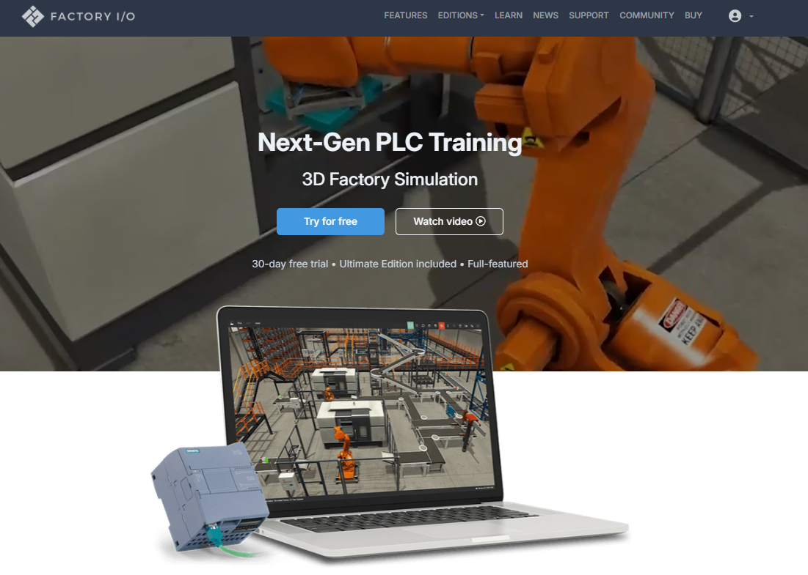

- 다운로드 & 설치
https://factoryio.com/download-archive

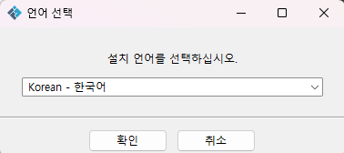

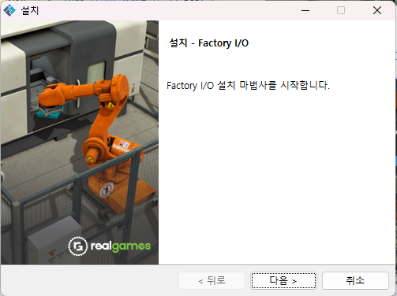

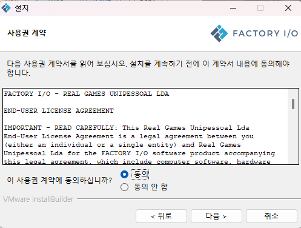

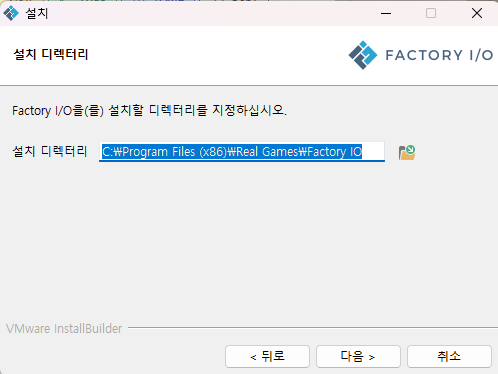

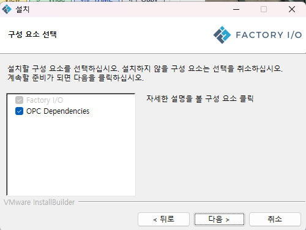

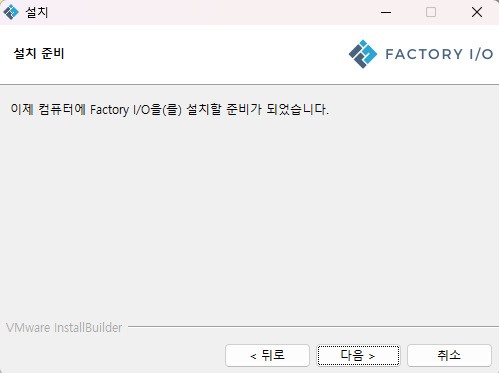

---

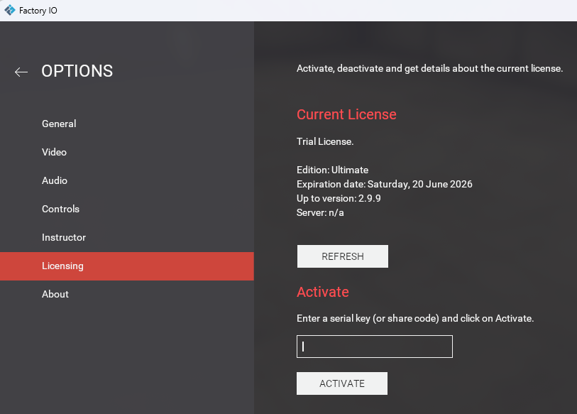

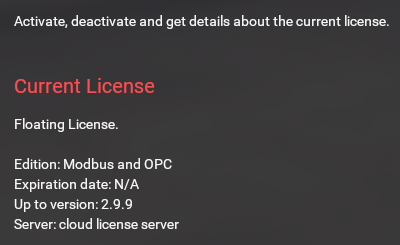

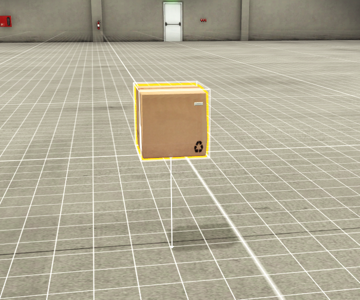

- 제어


- 시점


- 오브젝트

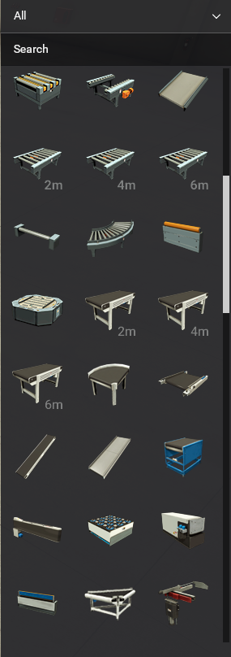


## [FA] 스마트팩토리, DX ,AX

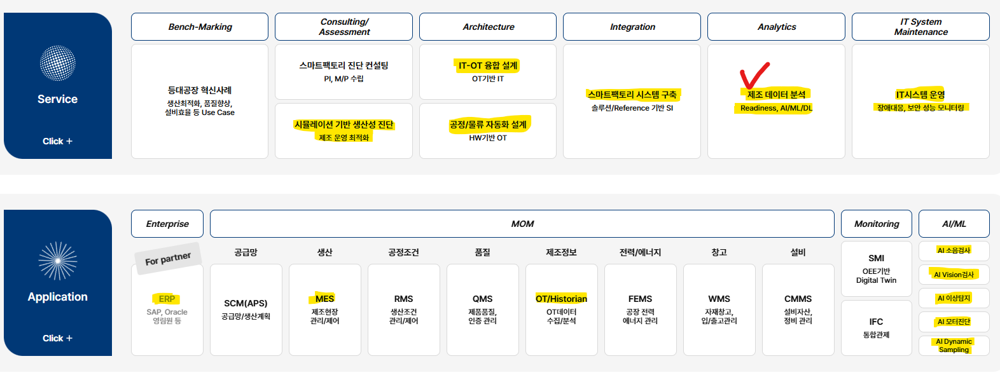
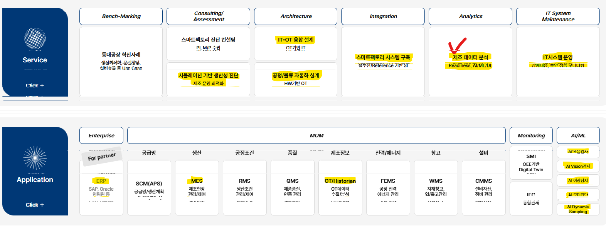

관련 링크
> https://www.ls-electric.com/ko/
https://beyondx-sf.ls-electric.com/solution/offerings.php
https://www.cimon.co.kr/introduction/scada/

#스마트팩토리 #AX #LS일렉트릭 #SCADA
 
## [FA] CIMON SCADA

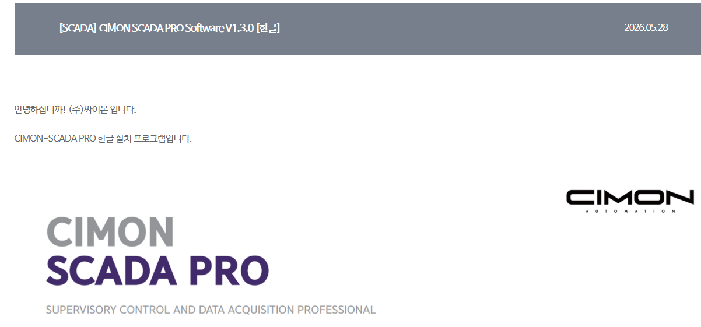

> PRO버전이 다른점 : 파이썬가능

# SCADA란 무엇인가? (노트 FA)

## 개요
SCADA(Supervisory Control and Data Acquisition)는 산업 현장의 설비나 공정 데이터를 실시간으로 수집, 감시, 제어하는 시스템을 의미합니다. 마치 공장의 '신경망'과 같아서, 여러 장치에서 보내오는 정보를 한곳에서 파악하고 필요한 조치를 취할 수 있게 도와줍니다. 이는 주로 발전, 제조, 정수, 석유화학 등 대규모 산업 시설에서 운영 효율성을 높이고 안전을 확보하는 데 필수적으로 사용됩니다.

## 주요 내용

### 데이터 수집 및 감시
SCADA 시스템은 현장에 설치된 센서, PLC(Programmable Logic Controller) 등 다양한 장비로부터 데이터를 실시간으로 수집합니다. 이 데이터에는 온도, 압력, 유량, 전압 등 산업 공정의 상태를 나타내는 여러 지표들이 포함됩니다. 수집된 데이터는 중앙 운영 센터로 전송되어 운영자가 한눈에 공정 상태를 파악할 수 있도록 시각화됩니다. 이를 통해 이상 징후를 즉시 감지하고 대응할 수 있습니다.

### 원격 제어
SCADA 시스템은 단순한 감시 기능을 넘어, 원격으로 장비나 공정을 제어할 수 있는 기능을 제공합니다. 운영자는 중앙 시스템을 통해 밸브를 열고 닫거나, 모터의 속도를 조절하는 등의 작업을 수행할 수 있습니다. 이는 현장에 직접 가지 않고도 신속하고 효율적인 조치가 가능하게 하여 운영 효율성을 크게 향상시킵니다.

### 경보 및 알림 기능
중요한 데이터가 설정된 범위를 벗어나거나 문제가 발생했을 때, SCADA 시스템은 즉시 경보를 발생시키거나 관련 담당자에게 알림을 보냅니다. 이러한 신속한 경보 시스템은 사고 발생 가능성을 줄이고, 사고 발생 시 피해를 최소화하는 데 중요한 역할을 합니다. 알림은 음성, SMS, 이메일 등 다양한 방식으로 전달될 수 있습니다.

## 특징

*   **실시간성**: 공정 데이터를 즉각적으로 파악하고 제어할 수 있습니다.
*   **분산 제어**: 넓은 지역에 걸친 설비들을 중앙에서 통합 관리할 수 있습니다.
*   **데이터 기록 및 분석**: 수집된 데이터를 장기간 저장하고 분석하여 공정 개선에 활용할 수 있습니다.
*   **확장성**: 새로운 설비나 장치를 쉽게 추가하여 시스템을 확장할 수 있습니다.

## 정리
SCADA 시스템은 현대 산업 자동화의 핵심 기술로서, 방대한 양의 산업 데이터를 효율적으로 관리하고 제어함으로써 생산성 향상, 비용 절감, 안전 강화에 크게 기여하고 있습니다. 특히, 최근에는 IT(Information Technology)와 OT(Operational Technology)의 융합, 그리고 AI 기술의 발전과 함께 더욱 지능화되고 통합된 형태로 발전하고 있습니다.


---
**관련 태그:** #SCADA #산업 자동화 #데이터 수집 #원격 제어 #운영 효율성

# [FA] SCADA CIMON 처음

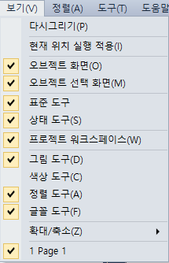

# [FA] docker-compose 로 모드버스 실습 컨테이너 실습1


### 1. 각각의 폴더를 만들어 연결준비
- 서버 컨테이너는 볼륨으로 로컬 서버 폴더에 연결
- 클라이언트 컨테이너는 볼륨으로 로컬 클라이언트 폴더에 연결
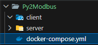

---

```yaml
services:
  # 서버용 주피터: modbus_server.ipynb 로 서버 기동 + 값 실시간 변경
  server-lab:
    image: python:3.12-slim
    working_dir: /app
    volumes:
      - ./server:/app
    command:
      [
        "bash",
        "-c",
        "pip install --no-cache-dir 'pymodbus==3.10.0' jupyterlab && jupyter lab --ip=0.0.0.0 --port=8888 --no-browser --allow-root --IdentityProvider.token='py'",
      ]
    ports:
      - "8889:8888" # 서버 주피터: http://localhost:8889
      - "5020:5020" # Modbus 서버 포트 (호스트에서도 접속 가능)

  # 클라이언트용 주피터: modbus_client.ipynb 로 서버에 접속
  client-lab:
    image: python:3.12-slim
    working_dir: /app
    volumes:
      - ./client:/app
    command:
      [
        "bash",
        "-c",
        "pip install --no-cache-dir 'pymodbus==3.10.0' jupyterlab && jupyter lab --ip=0.0.0.0 --port=8888 --no-browser --allow-root --IdentityProvider.token='py'",
      ]
    ports:
      - "8888:8888" # 클라이언트 주피터: http://localhost:8888
    depends_on:
      - server-lab

```
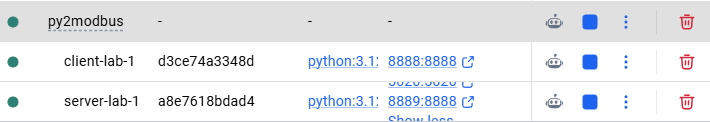

---
### 2. 폴더내에 각각의 ipynb 파일을 생성
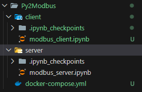

### 3. 각각 vscode에서 각각의 kernel을 연결
> 클라이언트용: http://localhost:8888/lab
> 서버용: http://localhost:8889/lab
> 비밀번호: `py`
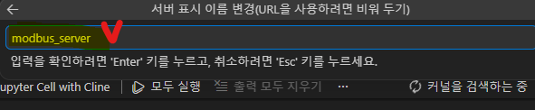

### 4. vscode 에서 각각의 파일에서 연결확인

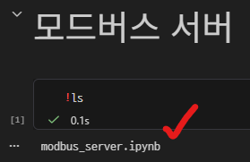

# [FA] docker-compose 로 모드버스 실습 컨테이너 실습2


1. 환경 알려주고 plan을 잡는다.

```md
@docker-compose.yml 모드버스 서버와 클라이언트의 접속 실습예정.
0. modbus_server.ipynb파일에서 먼저작업 후 modbus_client.ipynb작업을 맞춰서 하라.
 그리고 모든 셀에 모드버스에 대한 학습 설명을 첫셀에 요약 하고 단계별 주석으로 설명 추가하기.

1. modbus_server.ipynb파일
 a. 서버 컨테이너에서  모드버스 서버를 5020포트로 준비.
 b. 비트와 워드로 읽기와 쓰기를 테스트 할 수 있도록 단계별로 실습구성

2. modbus_client.ipynb파일
 a. 컨테이너의 020포트로 접속하기
 b. 비트,워드의 읽기/읽고쓰기의 실습환경을 1번에 맞춰 설정.

3. 위 두파일이 서로 실습환경이 맞춰서 동작할 수 있도록 구성.

4. pymodbus 3.10.0은 ModbusSlaveContext → ModbusDeviceContext, ModbusServerContext(유지) 로 rename됨 — 코드 작성 전 반드시 dir(pymodbus.datastore) 로 실제 클래스명 확인 후 사용할 것.

5. pymodbus 에 대한 버전에 맞는 코드작성

6. master, slave 가 client 와 server 로 용어바뀐 것을 지켜라.

```

2. 계획 확인 후 빠진것 있으면 수정. 
 예) pymodbus 에 대한 버전에 맞는 코드작성도 같이 요청하시오.

3. plan 첨부
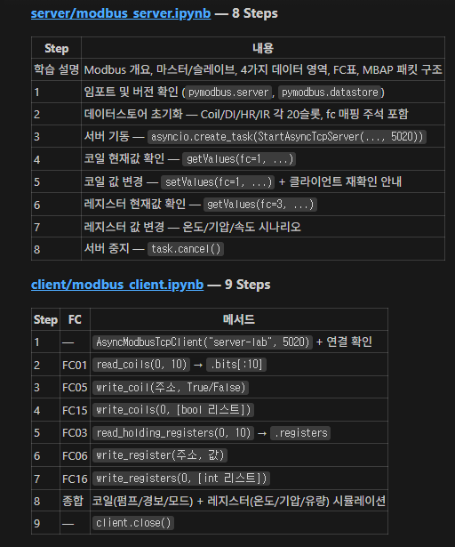

# [FA] docker-compose 로 모드버스 실습 컨테이너 실습3

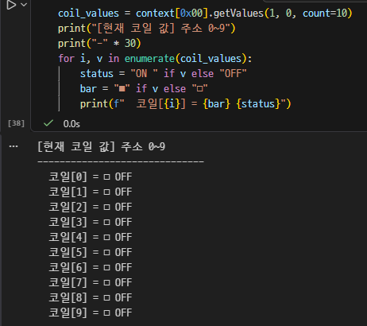
### Modbus 데이터 영역 (4가지)

| 영역 이름 | 주소 접두어 | 데이터 타입 | 클라이언트 접근 | 실제 용도 |
|-----------|------------|------------|----------------|----------|
| **Coil** | 0x (0xxxx) | 비트 (0/1) | 읽기 + **쓰기** | 디지털 출력 (릴레이, 램프) |
| **Discrete Input** | 1x (1xxxx) | 비트 (0/1) | 읽기 전용 | 디지털 입력 (버튼, 센서) |
| **Input Register** | 3x (3xxxx) | 워드 (16bit) | 읽기 전용 | 아날로그 입력 (온도, 압력) |
| **Holding Register** | 4x (4xxxx) | 워드 (16bit) | 읽기 + **쓰기** | 설정값 저장 (속도, 목표값) |

### Function Code (FC) 표

| FC | 기능 | 대상 영역 |
|----|------|-----------|
| 01 | Read Coils | Coil |
| 02 | Read Discrete Inputs | Discrete Input |
| 03 | Read Holding Registers | Holding Register |
| 04 | Read Input Registers | Input Register |
| 05 | Write Single Coil | Coil |
| 06 | Write Single Register | Holding Register |
| 15 | Write Multiple Coils | Coil |
| 16 | Write Multiple Registers | Holding Register |


### 실습 항목
| 단계 | 항목 |
|------|------|
| Step 1 | 서버 연결 확인 |
| Step 2 | 비트(Coil) 읽기 |
| Step 3 | 비트(Coil) 단일 쓰기 |
| Step 4 | 비트(Coil) 다중 쓰기 |
| Step 5 | 워드(Holding Register) 읽기 |
| Step 6 | 워드(Holding Register) 단일 쓰기 |
| Step 7 | 워드(Holding Register) 다중 쓰기 |
| Step 8 | 종합 실습 |
| Step 9 | 연결 종료 |


